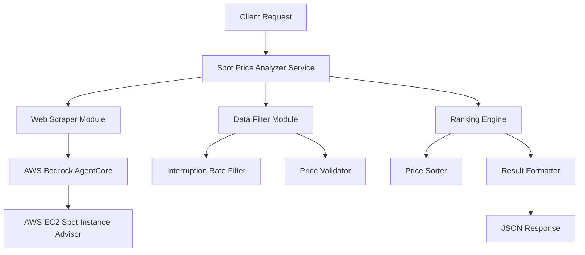

# Design Document

## Overview

The AWS Spot Price Analyzer is a service that leverages AWS Bedrock AgentCore to scrape and analyze real-time spot pricing data from the AWS EC2 Spot Instance Advisor. The system will filter results based on interruption rates and return the top 3 most cost-effective regions for p5en.48xlarge and p5.48xlarge instances.

## Architecture

The system follows a modular architecture with clear separation of concerns:



## Components and Interfaces

### 1. SpotPriceAnalyzer (Main Service)
- **Purpose**: Orchestrates the entire analysis workflow
- **Interface**: 
  ```python
  class SpotPriceAnalyzer:
      def analyze_spot_prices(self, instance_types: List[str]) -> List[SpotPriceResult]:
          pass
  ```

### 2. WebScraperService
- **Purpose**: Handles web scraping using AWS Bedrock AgentCore
- **Interface**:
  ```python
  class WebScraperService:
      def scrape_spot_data(self, url: str, instance_types: List[str]) -> List[RawSpotData]:
          pass
      def is_data_fresh(self, timestamp: datetime) -> bool:
          pass
  ```

### 3. DataFilterService
- **Purpose**: Filters regions based on interruption rates and data validity
- **Interface**:
  ```python
  class DataFilterService:
      def filter_by_interruption_rate(self, data: List[RawSpotData], max_rate: float) -> List[RawSpotData]:
          pass
      def validate_price_data(self, data: List[RawSpotData]) -> List[RawSpotData]:
          pass
  ```

### 4. RankingEngine
- **Purpose**: Sorts and ranks regions by price and secondary criteria
- **Interface**:
  ```python
  class RankingEngine:
      def rank_by_price(self, data: List[RawSpotData]) -> List[RankedSpotData]:
          pass
      def get_top_regions(self, data: List[RankedSpotData], count: int) -> List[SpotPriceResult]:
          pass
  ```

### 5. BedrockAgentService
- **Purpose**: Wrapper for AWS Bedrock AgentCore interactions
- **Interface**:
  ```python
  class BedrockAgentService:
      def execute_web_scraping(self, url: str, instructions: str) -> str:
          pass
      def parse_spot_data(self, html_content: str) -> List[RawSpotData]:
          pass
  ```

## Data Models

### RawSpotData
```python
@dataclass
class RawSpotData:
    region: str
    instance_type: str
    spot_price: float
    currency: str
    interruption_rate: float
    timestamp: datetime
    availability: bool
```

### SpotPriceResult
```python
@dataclass
class SpotPriceResult:
    region: str
    instance_type: str
    spot_price: float
    currency: str
    interruption_rate: float
    rank: int
    data_timestamp: datetime
```

### AnalysisResponse
```python
@dataclass
class AnalysisResponse:
    results: List[SpotPriceResult]
    total_regions_analyzed: int
    filtered_regions_count: int
    data_collection_timestamp: datetime
    warnings: Optional[List[str]] = None
```

## Error Handling

### 1. Web Scraping Errors
- **Network failures**: Retry mechanism with exponential backoff
- **Page structure changes**: Graceful degradation with error logging
- **Rate limiting**: Implement request throttling

### 2. Data Validation Errors
- **Missing price data**: Exclude region with warning
- **Invalid interruption rates**: Log error and exclude region
- **Stale data**: Force refresh if data is older than 1 hour

### 3. AWS Bedrock Errors
- **Service unavailable**: Return cached data if available, otherwise error
- **Authentication failures**: Clear error message for configuration issues
- **Quota exceeded**: Implement queuing mechanism

### 4. Business Logic Errors
- **Insufficient regions**: Return available regions with warning message
- **No valid data**: Return structured error response
- **Configuration errors**: Validate inputs and return clear error messages

## Testing Strategy

### 1. Unit Tests
- Test each service component in isolation
- Mock external dependencies (AWS Bedrock, web requests)
- Validate data transformation logic
- Test error handling scenarios

### 2. Integration Tests
- Test AWS Bedrock AgentCore integration
- Validate web scraping functionality with test pages
- Test end-to-end data flow
- Verify error propagation

### 3. Contract Tests
- Validate API response structure
- Test backward compatibility
- Verify data model consistency

### 4. Performance Tests
- Measure response times under normal load
- Test with multiple concurrent requests
- Validate memory usage during data processing

## Security Considerations

### 1. Web Scraping Security
- Implement rate limiting to avoid being blocked
- Use appropriate user agents
- Respect robots.txt guidelines
- Handle CAPTCHA scenarios gracefully

### 2. AWS Security
- Use IAM roles with minimal required permissions
- Encrypt sensitive configuration data
- Implement proper error handling to avoid information leakage
- Log security-relevant events

### 3. Data Privacy
- Do not store personal or sensitive AWS account information
- Implement data retention policies
- Ensure compliance with data protection regulations